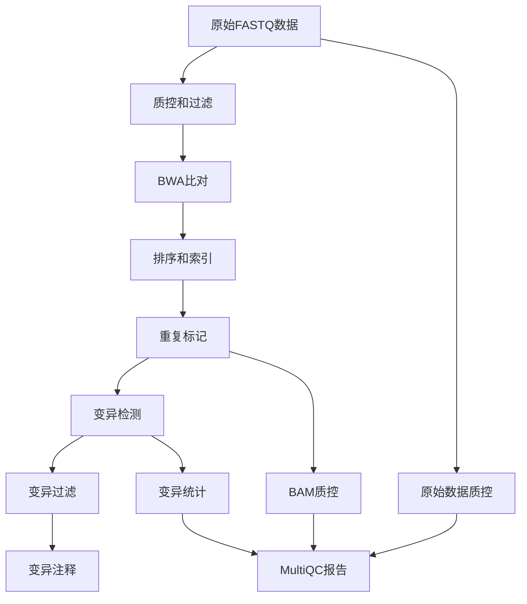

# WGS上游分析流程文档

## 概述

本项目是一个基于Nextflow的全基因组测序(WGS)上游分析流程，专门用于处理基因组重测序数据。该流程整合了从原始数据质控到变异检测和注释的完整分析步骤。

## 流程图



## 分析步骤

### 1. 数据预处理

#### FASTQ质控
- 使用FastQC对原始测序数据进行质控分析
- 生成质控报告用于评估数据质量

#### 数据过滤和修剪
- 使用Fastp对原始数据进行质量过滤和适配器修剪
- 设置质量阈值和长度要求

### 2. 序列比对

#### BWA-MEM2比对
- 使用BWA-MEM2将清理后的reads比对到参考基因组
- 生成SAM/BAM格式的比对结果

#### 排序和索引
- 使用Samtools对BAM文件进行排序
- 创建索引文件以提高后续分析效率

### 3. 重复标记

#### 使用Sambamba标记重复
- 识别并标记PCR重复和光学重复
- 提高变异检测的准确性

### 4. 变异检测

#### BCFtools变异调用
- 使用BCFtools mpileup和call命令进行变异检测
- 生成VCF格式的原始变异文件

#### 变异合并
- 合并所有样本的变异结果
- 创建统一的变异集合

### 5. 变异过滤

#### 质量过滤
- 根据缺失率(F_MISSING)和最小等位基因频率(MAF)进行过滤
- 保留高质量的SNP和InDel变异

### 6. 变异注释

#### SnpEff功能注释
- 使用SnpEff对变异进行功能注释
- 提供变异对基因功能的影响信息
- 生成HTML和CSV格式的注释报告

### 7. 质控统计

#### BAM质控
- 使用Qualimap进行BAM文件质控分析
- 生成覆盖度统计和比对统计信息

#### 变异统计
- 使用BCFtools和MultiQC生成变异统计报告
- 提供全面的变异质量评估

## 配置文件

### nextflow.config

主要配置文件包含以下参数配置：

#### 基本参数
- `project_name`: 项目名称
- `sample_csv`: 样本信息表路径
- `outdir`: 输出目录

#### 数据处理参数
- `length_required`: 过滤后所需的最小读长
- `quality_threshold`: 质量过滤阈值
- `adapter_fasta`: 适配器序列文件

#### 参考基因组
- `genome`: 参考基因组FASTA文件路径
- `bwa_index_path`: BWA索引文件路径

#### 软件路径配置
- 各种分析工具的可执行文件路径

#### 环境配置
- 为不同进程指定Conda环境文件

## 输入文件

### 样本信息表(sample.csv)

CSV格式的样本信息表，包含以下列：
- `sample_id`: 样本ID
- `fq1`: R1端FASTQ文件路径
- `fq2`: R2端FASTQ文件路径

示例：
```csv
sample_id,fq1,fq2
sample1,/path/to/sample1_R1.fq.gz,/path/to/sample1_R2.fq.gz
sample2,/path/to/sample2_R1.fq.gz,/path/to/sample2_R2.fq.gz
```

### 参考基因组文件

- 参考基因组FASTA文件
- BWA索引文件
- 基因组注释文件(GFF/GTF)
- SnpEff数据库文件

## 输出文件

流程输出按分析步骤组织在不同目录中：

### 01_qc/
- 原始数据质控报告

### 02_mapping/
- 比对结果(BAM文件)
- 排序和索引文件

### 03_variant_calling/
- 原始变异文件(VCF)
- 过滤后的变异文件
- 注释结果文件

### 其他质控报告
- BAM质控报告
- 变异统计报告
- MultiQC综合报告

## 运行流程

### 基本命令

```bash
nextflow run main.nf -profile conda
```

### 参数配置

```bash
nextflow run main.nf \
  --sample_csv path/to/sample.csv \
  --outdir path/to/results \
  -profile conda
```

### 使用Docker

```bash
nextflow run main.nf -profile docker
```

## 依赖软件

- Nextflow >= 21.04
- FastQC
- Fastp
- BWA-MEM2
- Samtools
- Sambamba
- BCFtools
- SnpEff
- Qualimap
- MultiQC

## 环境配置

使用Conda环境管理依赖软件：
- `envs/fastqc.yaml`
- `envs/fastp.yaml`
- `envs/bwa2.yaml`
- `envs/snpEff.yaml`
- `envs/qualimap.yaml`
- `envs/mosdepth.yaml`
- `envs/multiqc.yaml`

## 故障排除

### 常见问题

#### BWA索引问题
如果遇到"prefix is too long"错误：
- 确保使用预建的BWA索引文件
- 检查索引文件完整性

#### 内存不足
- 调整`cpus`参数分配合适的核心数
- 修改进程内存配置

#### 样本信息表错误
- 检查CSV格式是否正确
- 确保文件路径有效

### 日志查看

查看详细日志信息：
```bash
tail -f .nextflow.log
```

查看特定进程日志：
```bash
# 进入工作目录查看
ls work/
```

## 开发和维护

### 模块化设计

流程采用模块化设计，每个分析步骤作为独立的Nextflow模块：
- `modules/fastqc_raw.nf`
- `modules/fastp_clean.nf`
- `modules/bwa_mem.nf`
- `modules/samtools_sort_index.nf`
- 等等...

### 扩展性

添加新分析步骤：
1. 创建新的模块文件
2. 在主流程中引入模块
3. 在配置文件中添加相应的进程配置

## 许可证

[待添加具体许可证信息]